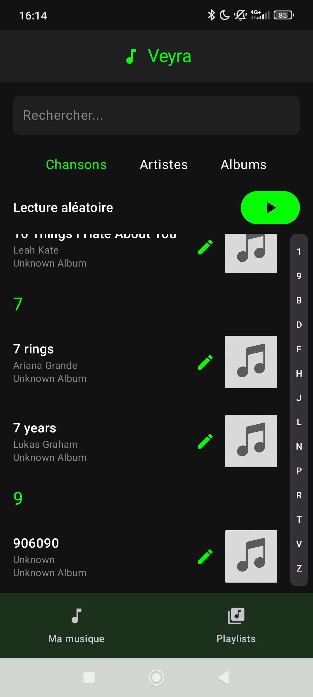
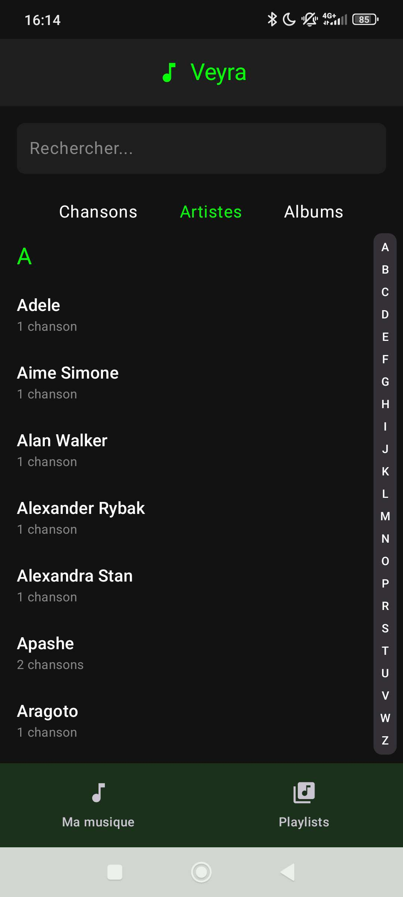
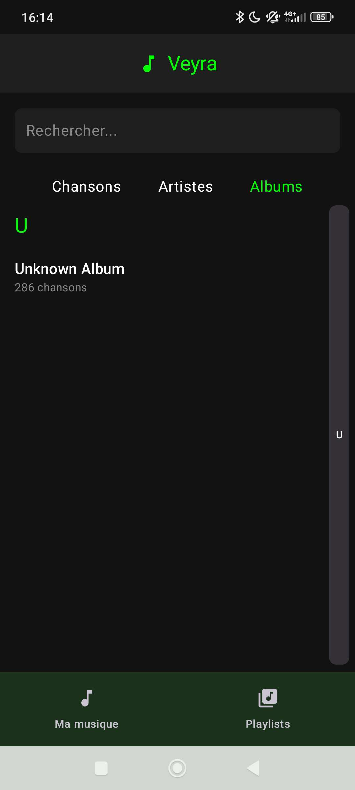
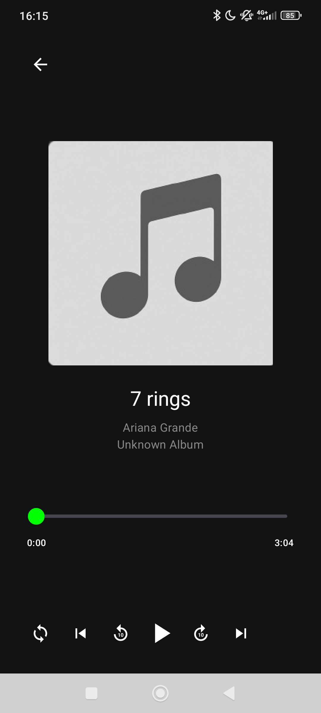
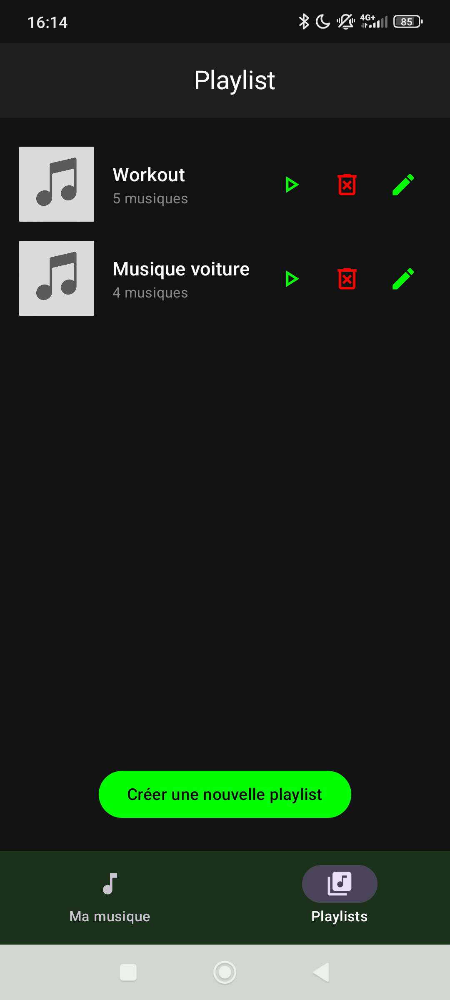
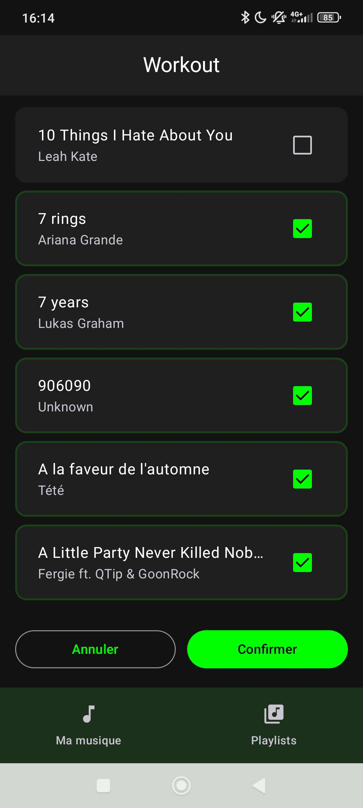
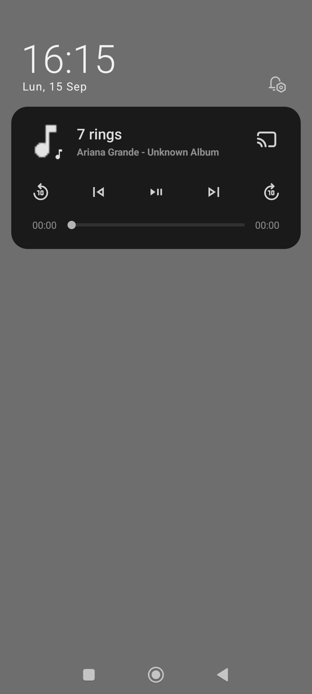

# 🎶 Veyra

Veyra est une application Android de musique **locale, simple et sans pubs**, développée en **Kotlin** avec **Jetpack Compose**.  
Elle permet de lire vos fichiers audio, de gérer vos playlists et d’éditer les métadonnées de vos morceaux directement depuis l’application.

---

## ✨ Fonctionnalités

- 🎵 Lecture de fichiers audio locaux (MP3, FLAC…)
- 📂 Navigation par **Chansons**, **Artistes** et **Albums**
- 🗂️ Création et gestion de playlists personnalisées
- 🔀 Lecture aléatoire (shuffle) intelligente
- 🎚️ Contrôles supplémentaires depuis :
  - la barre de notifications
  - l’écran verrouillé
  - les écouteurs
- ✏️ Modification des métadonnées (titre, artiste, album, photo) sans quitter l’app
- 🖼️ Interface moderne basée sur **Material You** (Material3)

---

## 📸 Captures d’écran

  
  
  
  
  
  
  

---

## 🛠️ Technologies utilisées

- **Langage** : [Kotlin](https://kotlinlang.org/)
- **UI** : [Jetpack Compose](https://developer.android.com/jetpack/compose)
- **Audio** : [ExoPlayer](https://exoplayer.dev/) + [MediaSessionCompat](https://developer.android.com/reference/android/support/v4/media/session/MediaSessionCompat)
- **Architecture** : MVVM avec `ViewModel` et `State`
- **Stockage** : Accès direct aux fichiers du téléphone
- **Gestion des métadonnées** : lecture/écriture via un `MetadataManager` custom
- **Navigation** : [Navigation Compose](https://developer.android.com/jetpack/compose/navigation)
